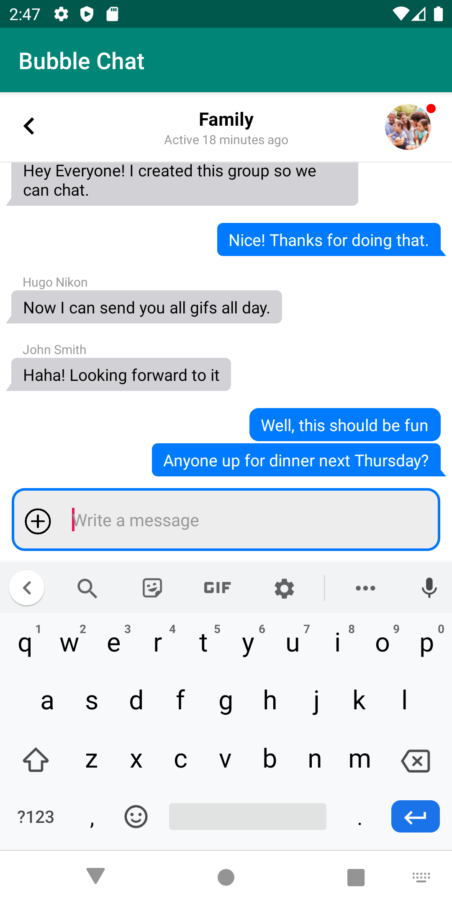
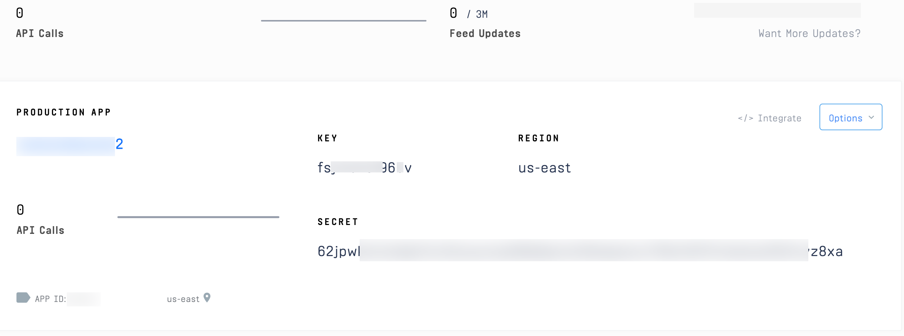
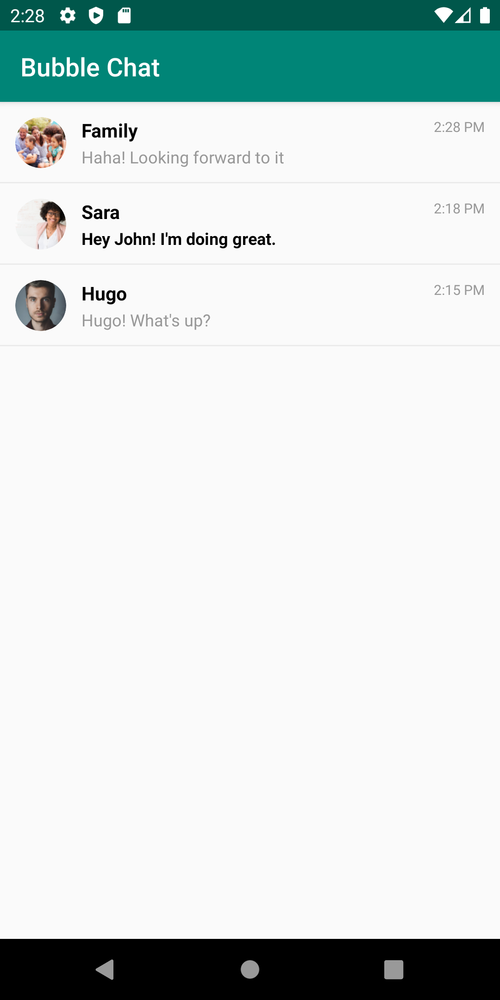
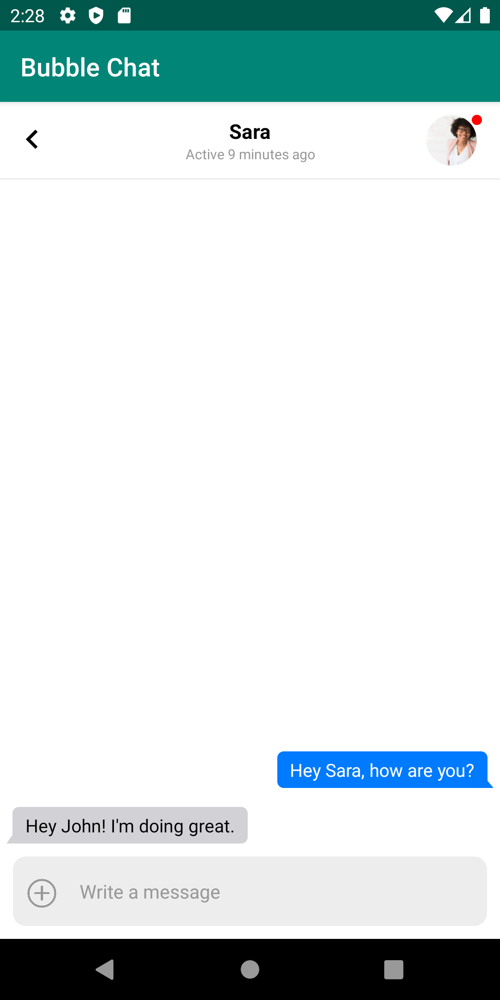
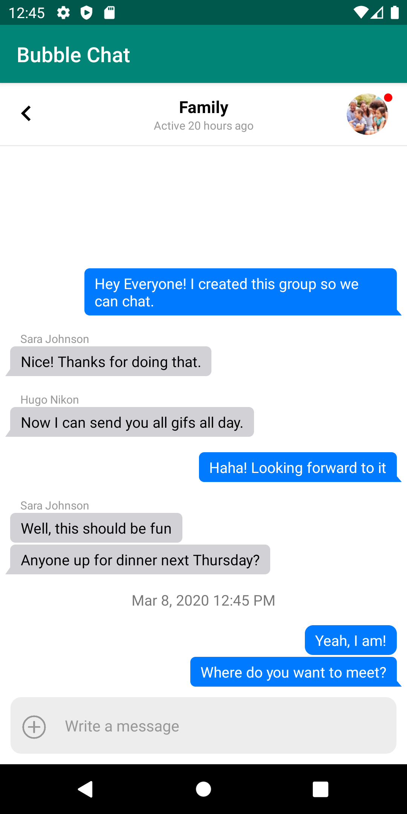

# Bubble Chat: Building iOS Style Chat in Android with Stream Chat

In this post, we explore how to do two things: 1) create message bubbles in Android that are similar to WhatsApp and iMessage and 2) how to customize Stream Chat's [UI Components](https://github.com/GetStream/stream-chat-android#ui-components--chat-views). 

We'll customize [Stream Chat Android](https://github.com/GetStream/stream-chat-android)'s built-in UI components by plugging in a custom message view. This allows us to focus on the text rendering while Stream does everything else.

The source code is available [here](https://github.com/psylinse/stream-android-bubble-chat). Once we're done, we'll have a chat experience that looks like this:



## Prerequisites 

This post assumes a working knowledge of Android. If you're brand new, it may be useful to check out a [getting started](https://developer.android.com/training/basics/firstapp) guide. If you'd like to run the code, you'll need a Stream account. Please [register here](https://getstream.io/chat/trial/). Once you're registered you'll see a Stream app with an `App Id`, `API Key`, and `Secret`. 




We won't go through how to create the backend to receive our tokens in this tutorial. Please refer to [this repo](https://github.com/nparsons08/stream-chat-api) for token generation. You can also use [Stream's CLI](https://www.npmjs.com/package/getstream-cli). If you look in [MainActivity.kt](https://github.com/psylinse/stream-android-bubble-chat/blob/master/app/src/main/java/com/example/bubblechat/MainActivity.kt) you'll see placeholders to fill in run the application.

Let's build!

## Listing Channels

First, we'll create a view which displays a list of channels for a user to select:



This view is mostly taken care of by Stream's UI Components. To list our channels, the `MainActivity.kt` will leverage Stream's [ChannelList](https://github.com/GetStream/stream-chat-android/blob/master/docs/ChannelList.md). We'll configure it to load all of the channels for our user. Here's the code:

```kotlin
// com/example/bubblechat/MainActivity.kt:13
class MainActivity : AppCompatActivity() {
    override fun onCreate(savedInstanceState: Bundle?) {
        super.onCreate(savedInstanceState)

        // setup the client using the example API key
        // normally you would call init in your Application class and not the activity
        StreamChat.init("<STREAM_API_KEY>", this.applicationContext)
        val client = StreamChat.getInstance(this.application)
        val extraData = HashMap<String, Any>()
        extraData["name"] = "<USERNAME>"
        extraData["image"] = "<PROFILE_IMAGE_URL>"
        val currentUser = User("<USER_ID>", extraData)
        // User token is typically provided by your server when the user authenticates
        client.setUser(
            currentUser,
            "<STREAM_FRONTEND_TOKEN>"
        )

        // we're using data binding in this example
        val binding: ActivityMainBinding =
            DataBindingUtil.setContentView(this, R.layout.activity_main)
        // Specify the current activity as the lifecycle owner.
        binding.lifecycleOwner = this

        // most the business logic for chat is handled in the ChannelListViewModel view model
        val viewModel = ViewModelProviders.of(this).get(ChannelListViewModel::class.java)
        binding.viewModel = viewModel
        binding.channelList.setViewModel(viewModel, this)

        // query all channels of type messaging
        val filter = and(eq("type", "messaging"), `in`("members", currentUser.id))
        viewModel.setChannelFilter(filter)

        // click handlers for clicking a user avatar or channel
        binding.channelList.setOnChannelClickListener { channel ->
            val intent = ChannelActivity.newIntent(this, channel)
            startActivity(intent)
        }
    }
}
```

First, we initialize our `StreamChat` instance with our API key. We configure it with the user who'll be using our application. To keep things simple, we'll just declare who's logged in and their frontend token. In a real application, you'd want to perform authentication with a [backend](https://getstream.io/blog/tutorial-user-auth-with-stream-chat-feeds/) that generates this token.

We also give the user a user id, a name, and a profile image. Once we've done this we can declare the layout `activity_main`. The view needs a view model. In this case, we'll simply use the default Stream provided `ChannelListViewModel`. This is great, as it does all the work to interact with Stream's API. We simply need to configure it to [filter](https://getstream.io/chat/docs/query_channels/?language=js) for our user's id. 

Last thing we do is set a click listener on each channel. We boot a `ChannelActivity` which is where we'll customize the chat messages. Before we look at the code for `ChannelActivity` let's look at the layout:

```xml
<!-- layout/activity_main.xml -->
<?xml version="1.0" encoding="utf-8"?>
<layout xmlns:android="http://schemas.android.com/apk/res/android"
    xmlns:app="http://schemas.android.com/apk/res-auto"
    xmlns:tools="http://schemas.android.com/tools">

    <data>
        <variable
            name="viewModel"
            type="com.getstream.sdk.chat.viewmodel.ChannelListViewModel" />
    </data>

    <androidx.constraintlayout.widget.ConstraintLayout
        android:layout_width="match_parent"
        android:layout_height="match_parent"
        tools:context="com.example.chattutorial.MainActivity">

        <com.getstream.sdk.chat.view.ChannelListView
            android:id="@+id/channelList"
            android:layout_width="match_parent"
            android:layout_height="0dp"
            android:layout_marginBottom="10dp"
            app:layout_constraintBottom_toBottomOf="parent"
            app:layout_constraintTop_toTopOf="parent"
            app:streamReadStateAvatarHeight="15dp"
            app:streamReadStateAvatarWidth="15dp"
            app:streamReadStateTextSize="9sp"
            app:streamShowReadState="true" />

        <ProgressBar
            android:layout_width="wrap_content"
            android:layout_height="wrap_content"
            app:isGone="@{!safeUnbox(viewModel.loading)}"
            app:layout_constraintBottom_toBottomOf="parent"
            app:layout_constraintEnd_toEndOf="parent"
            app:layout_constraintStart_toStartOf="parent"
            app:layout_constraintTop_toTopOf="parent" />

        <ProgressBar
            android:layout_width="25dp"
            android:layout_height="25dp"
            android:layout_marginBottom="16dp"
            app:isGone="@{!safeUnbox(viewModel.loadingMore)}"
            app:layout_constraintBottom_toBottomOf="parent"
            app:layout_constraintEnd_toEndOf="parent"
            app:layout_constraintStart_toStartOf="parent" />

    </androidx.constraintlayout.widget.ConstraintLayout>
</layout>
```

We use a `ConstraintLayout` to hold our `ChannelListView` and `ProgressBar`s. Since the view is mostly taken care of by Stream, we just need to configure when our progress bars show and what our padding and margin are.  

Now we're ready to view a specific channel.

## Viewing a Channel

Once a user clicks a channel, our `ChannelActivity` starts. Here is the code:

```kotlin
// com/example/bubblechat/ChannelActivity.kt:14
class ChannelActivity : AppCompatActivity() {
    private var viewModel: ChannelViewModel? = null
    private var binding: ActivityChannelBinding? = null

    override fun onCreate(savedInstanceState: Bundle?) {
        super.onCreate(savedInstanceState)

        val channelType = intent.getStringExtra(EXTRA_CHANNEL_TYPE)
        val channelID = intent.getStringExtra(EXTRA_CHANNEL_ID)
        val client = StreamChat.getInstance(application)

        binding = DataBindingUtil.setContentView(this, R.layout.activity_channel)
        binding!!.lifecycleOwner = this

        val channel = client.channel(channelType, channelID)
        viewModel = ViewModelProviders.of(
            this,
            ChannelViewModelFactory(this.application, channel)
        ).get(ChannelViewModel::class.java)

        binding!!.viewModel = viewModel
        binding!!.messageList.setViewHolderFactory(BubbleMessageViewHolderFactory())
        binding!!.messageList.setViewModel(viewModel!!, this)
        binding!!.messageInput.setViewModel(viewModel, this)
        binding!!.channelHeader.setViewModel(viewModel, this)
    }

    companion object {
        private val EXTRA_CHANNEL_TYPE = "com.example.bubblechat.CHANNEL_TYPE"
        private val EXTRA_CHANNEL_ID = "com.example.bubblechat.CHANNEL_ID"

        fun newIntent(context: Context, channel: Channel): Intent {
            val intent = Intent(context, ChannelActivity::class.java)
            intent.putExtra(EXTRA_CHANNEL_TYPE, channel.type)
            intent.putExtra(EXTRA_CHANNEL_ID, channel.id)
            return intent
        }
    }
}
```

First, we get our channel information off of the `Intent` from our `ChannelActivity.newIntent` call in `MainActivity`. We set our content view `activity_channel` and view model:

```xml
<!-- layout/activity_channel.xml -->
<?xml version="1.0" encoding="utf-8"?>
<layout xmlns:android="http://schemas.android.com/apk/res/android"
    xmlns:app="http://schemas.android.com/apk/res-auto"
    xmlns:tools="http://schemas.android.com/tools">

    <data>
        <variable
            name="viewModel"
            type="com.getstream.sdk.chat.viewmodel.ChannelViewModel" />
    </data>

    <androidx.constraintlayout.widget.ConstraintLayout
        android:layout_width="match_parent"
        android:layout_height="match_parent"
        android:background="#FFF"

        tools:context="com.example.bubblechat.ChannelActivity">

        <com.getstream.sdk.chat.view.ChannelHeaderView
            android:id="@+id/channelHeader"
            android:layout_width="match_parent"
            android:layout_height="wrap_content"
            android:background="#FFF"
            app:streamChannelHeaderBackButtonShow="true"
            app:layout_constraintEnd_toStartOf="@+id/messageList"
            app:layout_constraintStart_toStartOf="parent"
            app:layout_constraintTop_toTopOf="parent" />

        <com.getstream.sdk.chat.view.MessageListView
            android:id="@+id/messageList"
            android:layout_width="match_parent"
            android:layout_height="0dp"
            android:layout_marginBottom="10dp"
            android:paddingStart="5dp"
            android:paddingEnd="5dp"
            android:background="#FFF"
            app:layout_constraintBottom_toTopOf="@+id/message_input"
            app:layout_constraintEnd_toEndOf="parent"
            app:layout_constraintStart_toStartOf="parent"
            app:layout_constraintTop_toBottomOf="@+id/channelHeader"
            />

        <TextView
            android:layout_width="wrap_content"
            android:layout_height="wrap_content"
            android:layout_marginTop="16dp"
            android:padding="6dp"
            app:layout_constraintRight_toRightOf="parent"
            app:layout_constraintTop_toTopOf="parent" />

        <ProgressBar
            android:layout_width="wrap_content"
            android:layout_height="wrap_content"
            app:isGone="@{!safeUnbox(viewModel.loading)}"
            app:layout_constraintBottom_toBottomOf="parent"
            app:layout_constraintEnd_toEndOf="parent"
            app:layout_constraintStart_toStartOf="parent"
            app:layout_constraintTop_toTopOf="parent" />

        <ProgressBar
            android:layout_width="25dp"
            android:layout_height="25dp"
            app:isGone="@{!safeUnbox(viewModel.loadingMore)}"
            app:layout_constraintEnd_toEndOf="parent"
            app:layout_constraintStart_toStartOf="parent"
            app:layout_constraintTop_toBottomOf="parent" />

        <com.getstream.sdk.chat.view.MessageInputView
            android:id="@+id/message_input"
            android:layout_width="match_parent"
            android:layout_height="wrap_content"
            android:layout_marginTop="32dp"
            android:layout_marginBottom="0dp"
            app:layout_constraintBottom_toBottomOf="parent"
            app:layout_constraintEnd_toEndOf="parent"
            app:layout_constraintLeft_toLeftOf="parent"
            app:layout_constraintRight_toRightOf="parent"
            app:layout_constraintStart_toEndOf="@+id/messageList" />
    </androidx.constraintlayout.widget.ConstraintLayout>
</layout>
```

Here's another `ConstraintLayout` with some views and progress bars. We use Stream's UI Components to build the majority of the view. `ChannelHeaderView` gives us a nice header with a channel image and channel name. `MessageListView` displays our messages and `MessageInputView` gives us a nice default message input.
 
We use the built in Stream view model and feed that to each view. However, we customize the `MessageListView` view by providing a custom message view factory, `BubbleMessageViewHolderFactory`. This factory hooks into Stream's code to provide a custom view for each message. This class is straightforward since all we're going to do is instantiate our bubble message class, `BubbleMessageViewHolder`:

```kotlin
// com/example/bubblechat/BubbleMessageViewHolderFactory.kt:6
class BubbleMessageViewHolderFactory : MessageViewHolderFactory() {
    override fun createMessageViewHolder(
        adapter: MessageListItemAdapter?,
        parent: ViewGroup?,
        viewType: Int
    ): BaseMessageListItemViewHolder {
        return BubbleMessageViewHolder(R.layout.bubble_message, parent)
    }
}
 ```

Now that we're hooked into the view rendering, we can customize our messages to look like iMessage or WhatsApp!

## Rendering Custom Bubble Messages

We're ready to declare our custom bubble view. To hook into into Stream's components we need to be a subclass of `BaseMessageListItemViewHolder`. Here is the basic class definition:

```kotlin
// com/example/bubblechat/BubbleMessageViewHolder.kt:20
class BubbleMessageViewHolder(resId: Int, viewGroup: ViewGroup?) :
    BaseMessageListItemViewHolder(resId, viewGroup) {
    private val header: Space = itemView.findViewById(R.id.space_header)
    private val text: TextView = itemView.findViewById(R.id.tv_text)
    private val username: TextView = itemView.findViewById(R.id.tv_username)

    private lateinit var channelState: ChannelState
    private lateinit var messageListItem: MessageListItem

    // to be defined...
}
```

We're passed a view resource from the factory called `bubble_message`. This view is referred to by `itemView`. From this we grab our message header (which will just be spacing in our case), our text view that will hold the message, and our username view. We also have a `MessageListItem` and `ChannelState` which hold data for our Stream message and channel, respectively. Let's check out our view:

```xml
<!--- layout/bubble_message.xml -->
<?xml version="1.0" encoding="utf-8"?>
<androidx.constraintlayout.widget.ConstraintLayout xmlns:android="http://schemas.android.com/apk/res/android"
    xmlns:app="http://schemas.android.com/apk/res-auto"
    android:layout_width="match_parent"
    android:layout_height="wrap_content">

    <Space
        android:id="@+id/space_header"
        android:layout_width="match_parent"
        android:layout_height="@dimen/stream_message_header_space_height"
        app:layout_constraintEnd_toEndOf="parent"
        app:layout_constraintStart_toStartOf="parent"
        app:layout_constraintTop_toTopOf="parent" />


    <TextView
        android:id="@+id/tv_username"
        style="@style/text_s"
        android:layout_width="wrap_content"
        android:layout_height="wrap_content"
        app:layout_constraintEnd_toEndOf="parent"
        app:layout_constraintStart_toStartOf="parent"
        app:layout_constraintTop_toBottomOf="@+id/space_header" />

    <TextView
        android:id="@+id/tv_text"
        android:layout_width="0dp"
        android:layout_height="wrap_content"
        app:layout_constraintEnd_toEndOf="parent"
        app:layout_constraintStart_toStartOf="parent"
        app:layout_constraintWidth_max="wrap"
        app:layout_constraintWidth_percent="0.8"
        app:layout_constraintTop_toBottomOf="@+id/tv_username"
        />
</androidx.constraintlayout.widget.ConstraintLayout>
```

This view is quite simple as it defines the three pieces we referenced before, the header spacing, the username, and the text. Notice there's no bubble logic here. To get the correct colors and shapes we'll use [drawables](https://developer.android.com/guide/topics/resources/drawable-resource) and some logic in our class to define how the message will look. This layout is simply the scaffolding for us to fill in.

Implementing this abstract class requires us to implement `setStyle` and `bind`. We'll ignore `setStyle` for this tutorial since we define all styles here. Check out [`MessageViewListStyle`](https://github.com/GetStream/stream-chat-android/blob/master/library/src/main/java/com/getstream/sdk/chat/view/MessageListViewStyle.java) to see all the ways you can customize the components without building your own class. However, in this post, we want to see how to do it ourselves!

The `bind` method is where we configure how the message looks:

```kotlin
// com/example/bubblechat/BubbleMessageViewHolder.kt:29
override fun bind(
    _context: Context,
    channelState: ChannelState,
    messageListItem: MessageListItem,
    _position: Int
) {
    this.channelState = channelState
    this.messageListItem = messageListItem

    when (this.messageListItem.type) {
        MESSAGEITEM_MESSAGE -> {
            configMessage()
        }
        MESSAGEITEM_DATE_SEPARATOR -> {
            configDate()
        }
        else -> {
            header.visibility = View.GONE
            text.visibility = View.GONE
            username.visibility = View.GONE
        }
    }
}
```

We're given a `ChannelState` and `MessageListItem` which has everything we need to figure out our display. First, we check the type of message. Stream has a few different message types which represent different things. For example, you may get a message type that indicates a user is typing or a date separator. In our case, we'll focus on two, the actual messages and date separators. For any other message type, we'll ignore it and remove that message from rendering entirely. 

Let's focus on the actual messages to start. We'll look at how to render the date separators after. Here is our `configMessage` method:

```kotlin
// com/example/bubblechat/BubbleMessageViewHolder.kt:53
private fun configMessage() {
    configText()
    configUsername()
    configSpacing()
}
```

We do three things: 1) configure the actual text display 2) decide if we need to show a username 3) decide how much spacing we have between messages.

First, let's see how we configure the actual text and render our bubble message:

```kotlin
// com/example/bubblechat/BubbleMessageViewHolder.kt:84
private fun configText() {
    text.text = messageListItem.message.text

    val params = text.layoutParams as ConstraintLayout.LayoutParams
    if (messageListItem.isMine) {
        params.horizontalBias = 1f
        text.setTextColor(Color.WHITE)
        text.setPadding(dpToPixel(10f), dpToPixel(5f), dpToPixel(15f), dpToPixel(5f))
        if (isBottom()) {
            text.setBackgroundResource(R.drawable.bubble_right_tail)
        } else {
            text.setBackgroundResource(R.drawable.bubble_right)
        }
    } else {
        params.horizontalBias = 0f
        text.setTextColor(Color.BLACK)
        text.setPadding(dpToPixel(15f), dpToPixel(5f), dpToPixel(10f), dpToPixel(5f))
        if (isBottom()) {
            text.setBackgroundResource(R.drawable.bubble_left_tail)
        } else {
            text.setBackgroundResource(R.drawable.bubble_left)
        }
    }

}
```

We set the `TextView`'s text then decide if it's "our" message or "theirs". If it's "ours" we display the message on the right in blue. If it's "theirs" it goes left in grey. To set the justification of the message we use `horizontalBias`. Setting it to `1` sets it to the right, `0` to the left. We set the text color based on the background since blue needs white text and grey needs black. Padding is set differently since the message will have the "tail" on the right or left depending on who's message it is. That tail will cause a different amount of padding depending on what side the message is on.

Since we're replicating iMessage's style, they don't render the tail unless it's the bottom message. Stream conveniently gives us position information and makes it easy to check message placement within a group of messages:

```kotlin
// com/example/bubblechat/BubbleMessageViewHolder.kt:116 
private fun isBottom(): Boolean {
    return messageListItem.positions.contains(MessageViewHolderFactory.Position.BOTTOM)
}
```

If the message is the bottom message, it means it's the only message or the last in a group of messages by the same user. If it's either of those, we add a tail, if it's not we just do a simple bubble. We set the background of the text view to a drawable. We'll look at "our" message drawables. Here's the drawable with a tail:

```xml
<!-- drawable/bubble_right_tail.xml -->
<?xml version="1.0" encoding="utf-8"?>
<layer-list xmlns:android="http://schemas.android.com/apk/res/android">
    <item android:left="20dp">
        <rotate
            android:fromDegrees="-40"
            android:pivotX="100%"
            android:pivotY="100%"
            android:toDegrees="0">
            <shape android:shape="rectangle">
                <solid android:color="#007AFF" />
            </shape>
        </rotate>
    </item>
    <item android:right="5dp">
        <shape android:shape="rectangle">
            <solid android:color="#007AFF" />
            <corners android:radius="5dp" />
        </shape>
    </item>
</layer-list>
```

We're doing a bit of a clever trick by defining `layer-list` with two items. One is a normal rectangle with rounding, the other is a rotated rectangle that is covered by the normal rectangle. We pad the normal rectangle out to give a small gutter so the edge of the rotated rectangle sticks out. This gives a nice "tail" for the message bubble. 

While we chose to keep it simple here with just rectangles, if you'd like a more stylized tail, such as the one you see in iMessage, you can use [vector drawables](https://developer.android.com/guide/topics/graphics/vector-drawable-resources) to convert an SVG to a drawable. 

For messages that don't need a tail, we define a simple shape with some spacing for the tail gutter:

```xml
<!-- drawable/bubble_right.xml -->
<?xml version="1.0" encoding="utf-8"?>
<layer-list xmlns:android="http://schemas.android.com/apk/res/android">
    <item android:right="5dp">
        <shape>
            <solid android:color="#007AFF" />
            <corners android:radius="8dp" />
        </shape>
    </item>
</layer-list>
```

Messages for "theirs" is the same pattern but mirrored and grey:

```xml
<!-- drawable/bubble_left_tail.xml -->
<?xml version="1.0" encoding="utf-8"?>
<layer-list xmlns:android="http://schemas.android.com/apk/res/android">
    <item android:right="20dp">
        <rotate
            android:fromDegrees="35"
            android:pivotX="0%"
            android:pivotY="100%"
            android:toDegrees="0">
            <shape android:shape="rectangle">
                <solid android:color="#D1D1D6" />
            </shape>
        </rotate>
    </item>
    <item android:left="5dp">
        <shape android:shape="rectangle">
            <solid android:color="#D1D1D6" />
            <corners android:radius="5dp" />
        </shape>
    </item>
</layer-list>

<!-- drawable/bubble_left.xml -->
<?xml version="1.0" encoding="utf-8"?>
<layer-list xmlns:android="http://schemas.android.com/apk/res/android">
    <item android:left="5dp">
        <shape>
            <solid android:color="#D1D1D6" />
            <corners android:radius="5dp" />
        </shape>
    </item>
</layer-list>
```

Nice! Now we have some good looking bubbles:




Now we can add the username, if necessary, and space the messages correctly. First, we'll look at `configUsername`:

```kotlin
// com/example/bubblechat/BubbleMessageViewHolder.kt:66
private fun configUsername() {
    if (channelState.members.size == 2 || messageListItem.isMine || !isTop()) {
        username.visibility = View.GONE
        return
    }

    username.text = messageListItem.message.user.name

    val params = username.layoutParams as ConstraintLayout.LayoutParams
    if (messageListItem.isMine) {
        params.horizontalBias = 1f
        params.rightMargin = 40
    } else {
        params.horizontalBias = 0f
        params.leftMargin = 40
    }
}
```

First, we decide if we show the username at all. There are three cases where we want it gone. If it's a 1-on-1 chat, if the message is "ours", or if it's not the top of a group of messages (otherwise we'd have usernames on every message within a grouping). This logic means we only label groups of messages from other people in group chats. 

If we have that case, we set the text of the username `TextView` to the user's name. We set the bias and margin depending on if it's on the right or the left.

Now we can space our messages depending on their placement in a group of messages:

```kotlin
// com/example/bubblechat/BubbleMessageViewHolder.kt:109
private fun configSpacing() {
    if (!isTop()) {
        header.layoutParams.height = 5
    }
}
```

This is simple since our default spacing is in our layout resource. We simply shrink the height if we're not the top message. Now you'll see nice spacing and appropriate tails with usernames in our group chats:


All that's left is to deal with our date separator messages and we're done! These messages come with no username and just a date. These are used to provide a horizontal separator between messages that are spaced out in time. For example, if you message back a day later, you can break up the view with date marker to inform the user of roughly when messages have come in. Here's `configDate`:

```kotlin
// com/example/bubblechat/BubbleMessageViewHolder.kt:59
private fun configDate() {
    username.visibility = View.GONE
    text.text = DateFormat
        .getDateTimeInstance(DateFormat.MEDIUM, DateFormat.SHORT)
        .format(messageListItem.date)
}
```

This is straightforward since our default text view has no styling and the correct spacing. We just need to turn off the username view and add the date. Now we have a nice date separator:



And we're done! We now have custom bubble messages hooked into Stream.

## Final Thoughts

Replicating iOS style messages on Android is relatively simple with drawables. Stream makes it even simpler with it's out of the box UI Components. You can start with Stream default views and customize them or build your own. If you want full control, you can ignore the UI Components and use the lower level Stream libraries directly. It's easy to peel back the layers when you need it!
